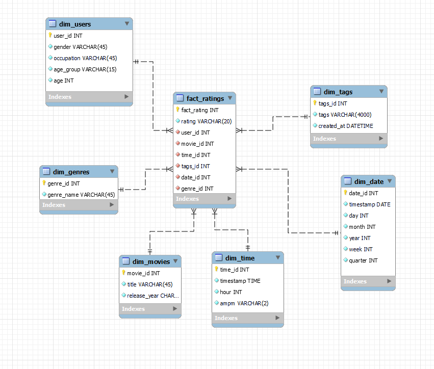
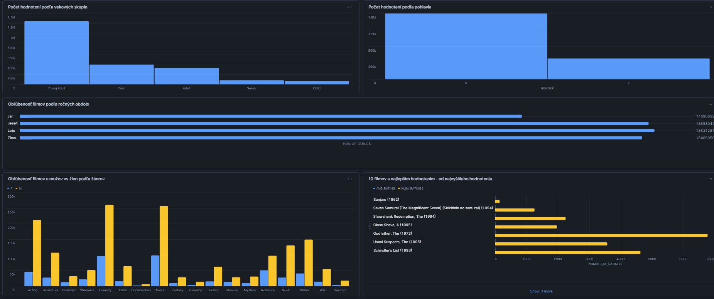

# ETL Proces - MovieLens

Tento repozitár obsahuje implementáciu ETL procesu v Snowflake pre analýzu dát z MovieLens datasetu. Hlavným cieľom projektu je analyzovať užívateľské hodnotenia filmov a identifikovať trendy v preferenciách na základe faktorov ako sú vek, pohlavie, povolanie a žánre filmov.

## 1. Úvod a popis zdrojových dát

### 1.1 Téma projektu
Hlavným cieľom projektu je analyzovať užívateľské hodnotenia filmov a identifikovať trendy v preferenciách na základe faktorov ako sú vek, pohlavie, povolanie a žánre filmov. Dataset MovieLens je jedným z najznámejších verejne dostupných zdrojov pre výskum odporúčacích systémov.

### 1.2 Zdroje dát
Dataset MovieLens obsahuje nasledujúce tabuľky:

- ``movies``: Táto tabuľka obsahuje základné informácie o filmoch vrátane názvu a roku vydania. Každý záznam reprezentuje jeden film.

- ``ratings``: Zaznamenáva hodnotenia filmov, ktoré užívatelia udelili. Tieto údaje sú kľúčové pre analýzu užívateľských preferencií a vývoj odporúčacích systémov.

- ``users``: Obsahuje demografické údaje o užívateľoch, ako sú vek, pohlavie, povolanie a poštové smerovacie číslo. Tieto údaje pomáhajú segmentovať užívateľov podľa ich charakteristík.

- ``genres``: Tabuľka s informáciami o filmových žánroch. Každý záznam reprezentuje jeden konkrétny žáner.

- ``genres_movies``: Prepojovacia tabuľka medzi filmami a ich žánrami. Umožňuje priradenie viacerých žánrov k jednému filmu.

- `tags`: Obsahuje tagy, ktoré užívatelia priraďujú filmom. Tagy poskytujú ďalšiu vrstvu informácií o preferenciách užívateľov a popise filmov.

- ``age_group``: Obsahuje kategórie vekových skupín, ktoré sú využité na zoskupenie užívateľov podľa veku. Umožňuje analýzu trendov medzi rôznymi vekovými kategóriami.

- ``occupations``: Táto tabuľka obsahuje zoznam povolaní užívateľov. Pomáha identifikovať rozdiely v preferenciách medzi užívateľmi s rôznymi povolaniami.

---

### 1.3 Dátová architektúra

### ERD diagram

Surové dáta sú usporiadané v relačnom modeli, ktorý je znázornený na entitno-relačnom diagrame (ERD):


<div align="center"><em>Obrázok 1 - Entitno-relačná schéma MovieLens</em></div>


## 2 Dimenzionálny model
### 2.1 Dimenzionálny model typu hviezda
Navrhnutý model je dimenzionálny model typu hviezda, ktorý je optimalizovaný pre analýzu hodnotení filmov. Model obsahuje jednu faktovú tabuľku a niekoľko dimenzionálnych tabuliek, ktoré podporujú analýzu užívateľských preferencií, trendov v hodnotení filmov a iných relevantných metrik.

### 2.2 Faktorová tabuľka `fact_ratings`
- **Metriky:**
  - `rating` – Hodnotenie filmu od užívateľa.
- **Kľúče:**
  - `user_id` – Cudzí kľúč odkazujúci na dimenziu užívateľov.
  - `movie_id` – Cudzí kľúč odkazujúci na dimenziu filmov.
  - `time_id` – Cudzí kľúč odkazujúci na dimenziu času.
  - `tags_id` - Cudzí kľúč odkazujúci na dimenziu tagov.
  - `date_id` - Cudzí kľúč odkazujúci na dimenziu dátumu.
  - `genre_id` - Cudzí kľúč odkazujúci na dimenziu žánrov.

### 2.3 Dimenzionálne tabuľky
#### Dimenzia `dim_users`
- **Obsah:** Táto dimenzia obsahuje demografické údaje užívateľov, ako sú vek, pohlavie, povolanie a poštové smerovacie číslo. Pomáha identifikovať vzory v hodnoteniach na základe charakteristík užívateľov. 
- **Typ dimenzie:** SCD typu 2 (sledovanie historických zmien, napr. zmena povolania užívateľa).

#### Dimenzia `dim_movies`
- **Obsah:** Obsahuje informácie o filmoch, ako je názov filmu, rok vydania a unikátne ID. Táto dimenzia umožňuje zoskupovať hodnotenia podľa jednotlivých filmov.
- **Typ dimenzie:** SCD typu 1 (hodnoty sa neaktualizujú, keďže filmy majú statické údaje).

#### Dimenzia `dim_genres`
- **Obsah:** Táto dimenzia obsahuje názvy žánrov, ktoré charakterizujú filmy. Podporuje analýzy preferencií na základe filmových žánrov.
- **Typ dimenzie:** SCD typu 1 (žánre sú statické a nemenia sa).

#### Dimenzia `dim_time`
- **Obsah:** Obsahuje časové údaje, ako sú hodiny, minúty a sekundy, ktoré umožňujú analyzovať časové vzory v hodnoteniach.
- **Typ dimenzie:** SCD typu 1 (údaje sú nemenné).

#### Dimenzia `dim_date`
- **Obsah:** Obsahuje dátumové údaje vrátane dňa, mesiaca, týždňa, štvrťroka a roku. Táto dimenzia umožňuje analýzy na základe kalendárnych vzorov.
- **Typ dimenzie:** SCD typu 1 (údaje sú nemenné).

#### Dimenzia `dim_tags`
- **Obsah:** Obsahuje tagy, ktoré užívatelia priraďujú filmom, čím poskytuje ďalšiu úroveň detailu o obsahu a preferenciách.
- **Typ dimenzie:** SCD typu 1 (údaje sú nemenné)

### 2.4 Vizualizácia dimenzionálneho modelu
Štruktúra hviezdicového modelu je znázornená na diagrame nižšie. Diagram ukazuje prepojenia medzi faktovou tabuľkou a dimenziami, čo zjednodušuje pochopenie a implementáciu modelu.


<div align="center"><em>Obrázok 2 Schéma hviezdy pre MovieLens</em></div>


## 3. ETL proces v Snowflake
### 3.1 Extract (Extrahovanie dát)
Dáta zo zdrojového datasetu (vo formáte .csv) boli najprv nahrané do Snowflake pomocou interného stage úložiska nazvaného my_stage. Stage v Snowflake slúži ako dočasné úložisko na import a export dát. Vytvorenie stage bolo realizované pomocou nasledujúceho príkazu:
```sql
CREATE OR REPLACE STAGE my_stage;
```

Do stage boli nahraté súbory, ktoré obsahujú údaje o filmoch, používateľoch, hodnoteniach, zamestnaniach, vekových kategóriách, žánroch a tagoch. Dáta boli načítané do staging tabuliek použitím príkazu COPY INTO. Tento príkaz bol použitý pre každú tabuľku.
```sql
COPY INTO ratings_staging
FROM @my_stage/ratings.csv
FILE_FORMAT = (TYPE = 'CSV', FIELD_OPTIONALLY_ENCLOSED_BY = '"', SKIP_HEADER = 1);
```

--- 


### 3.2 Transform (Transformácia dát)

### 3.3 Load (Načítanie dát)
Po úspešnom vytvorení dimenzií a faktovej tabuľky boli dáta načítané do konečného formátu. Staging tabuľky boli následne vymazané, aby sa optimalizovalo využitie úložiska.

Vymazanie staging tabuliek:
```sql
DROP TABLE IF EXISTS age_groups_staging;
DROP TABLE IF EXISTS movie_genres_staging;
DROP TABLE IF EXISTS movie_genre_relationship_staging;
DROP TABLE IF EXISTS movies_staging;
DROP TABLE IF EXISTS occupations_staging;
DROP TABLE IF EXISTS ratings_staging;
DROP TABLE IF EXISTS tags_staging;
DROP TABLE IF EXISTS users_staging;
```


## 4. Vizualizácia dát
Dashboard obsahuje 5 vizualizácii. 

<div align="center"><em>Obrázok 3 dashboard MovieLens datasetu</em></div>

___

### **Graf 1**: `Počet hodnotení podľa vekových skupín`
- **Popis: Ukazuje, ktoré vekové skupiny používateľov najviac hodnotia filmy.**
- **SQL dotaz:**
```sql
SELECT 
    u.age_group, 
    COUNT(f.fact_rating) AS num_ratings
FROM fact_ratings f
JOIN dim_users u ON f.user_id = u.user_id
GROUP BY u.age_group
ORDER BY num_ratings DESC;
```
___
### **Graf 2**: `Počet hodnotení podľa pohlavia`
- **Popis: Porovnanie počtu hodnotení medzi mužmi a ženami**
- **SQL dotaz:**
```sql
SELECT 
    u.gender, 
    COUNT(f.fact_rating) AS num_ratings
FROM fact_ratings f
JOIN dim_users u ON f.user_id = u.user_id
GROUP BY u.gender
ORDER BY num_ratings DESC;
```
___

### **Graf 3**: `Obľúbenosť filmov podľa ročných období`
- **Popis: Zobrazuje, v ktorých ročných obdobiach sa pridáva najviac hodnotení.**
- **SQL dotaz:**
```sql
SELECT 
    CASE 
        WHEN d.month IN (12, 1, 2) THEN 'Zima'
        WHEN d.month IN (3, 4, 5) THEN 'Jar'
        WHEN d.month IN (6, 7, 8) THEN 'Leto'
        WHEN d.month IN (9, 10, 11) THEN 'Jeseň'
    END AS season,
    COUNT(f.fact_rating) AS num_ratings
FROM fact_ratings f
JOIN dim_date d ON f.date_id = d.date_id
GROUP BY season
ORDER BY num_ratings DESC;
```
___

### **Graf 4**: `Obľúbenosť filmov u mužov vs žien podľa žánrov`
- **Popis: Porovnáva obľúbenosť žánrov medzi mužmi a ženami.**
- **SQL dotaz:**
```sql
SELECT 
    g.genre_name,
    u.gender,
    COUNT(f.fact_rating) AS num_ratings
FROM fact_ratings f
JOIN dim_users u ON f.user_id = u.user_id
JOIN dim_genres g ON f.genre_id = g.genre_id
GROUP BY g.genre_name, u.gender
ORDER BY g.genre_name, num_ratings DESC;

```
___
### **Graf 5**: `10 filmov s najlepším hodnotím - od najvyššieho hodnotenia`
- **Popis: Zobrazuje 10 filmov s najvyšším priemerným hodnotením**
- **SQL dotaz:**
```sql
SELECT 
    g.genre_name, 
    COUNT(f.fact_rating) AS num_ratings
FROM fact_ratings f
JOIN dim_genres g ON f.genre_id = g.genre_id
GROUP BY g.genre_name
ORDER BY num_ratings DESC
LIMIT 10;

```
___

**Autor:** Daniel Turančík
