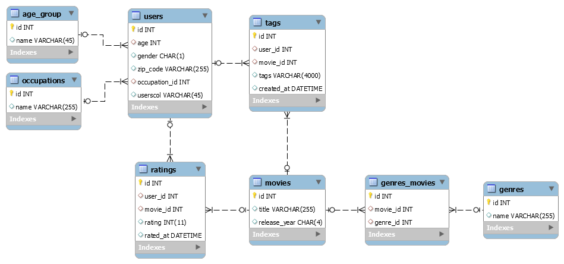

# ETL Proces - MovieLens

Tento projekt sa zameriava na implementáciu ETL procesu pre analýzu dát zo zdrojového datasetu **MovieLens**. Analýza sa vykonáva v databázovej platforme **Snowflake** s cieľom identifikovať vzory v užívateľských hodnoteniach filmov a preferenciách na základe demografických údajov.

---

## 1. Úvod a popis zdrojových dát

### 1.1 Téma projektu
Hlavným cieľom projektu je analyzovať užívateľské hodnotenia filmov a identifikovať trendy v preferenciách na základe faktorov ako sú vek, pohlavie, povolanie a žánre filmov. Dataset MovieLens je jedným z najznámejších verejne dostupných zdrojov pre výskum odporúčacích systémov.

### 1.2 Zdroje dát
Dataset MovieLens obsahuje nasledujúce tabuľky:

- **movies**: Táto tabuľka obsahuje základné informácie o filmoch vrátane názvu a roku vydania. Každý záznam reprezentuje jeden film.

- **ratings**: Zaznamenáva hodnotenia filmov, ktoré užívatelia udelili. Tieto údaje sú kľúčové pre analýzu užívateľských preferencií a vývoj odporúčacích systémov.

- **users**: Obsahuje demografické údaje o užívateľoch, ako sú vek, pohlavie, povolanie a poštové smerovacie číslo. Tieto údaje pomáhajú segmentovať užívateľov podľa ich charakteristík.

- **genres**: Tabuľka s informáciami o filmových žánroch. Každý záznam reprezentuje jeden konkrétny žáner.

- **genres_movies**: Prepojovacia tabuľka medzi filmami a ich žánrami. Umožňuje priradenie viacerých žánrov k jednému filmu.

- **tags**: Obsahuje tagy, ktoré užívatelia priraďujú filmom. Tagy poskytujú ďalšiu vrstvu informácií o preferenciách užívateľov a popise filmov.

- **age_group**: Obsahuje kategórie vekových skupín, ktoré sú využité na zoskupenie užívateľov podľa veku. Umožňuje analýzu trendov medzi rôznymi vekovými kategóriami.

- **occupations**: Táto tabuľka obsahuje zoznam povolaní užívateľov. Pomáha identifikovať rozdiely v preferenciách medzi užívateľmi s rôznymi povolaniami.

---

### 1.3 Dátová architektúra

### ERD diagram

Surové dáta sú usporiadané v relačnom modeli, ktorý je znázornený na entitno-relačnom diagrame (ERD):

<em>Obrázok 1 - Entitno-relačná schéma MovieLens</em>

